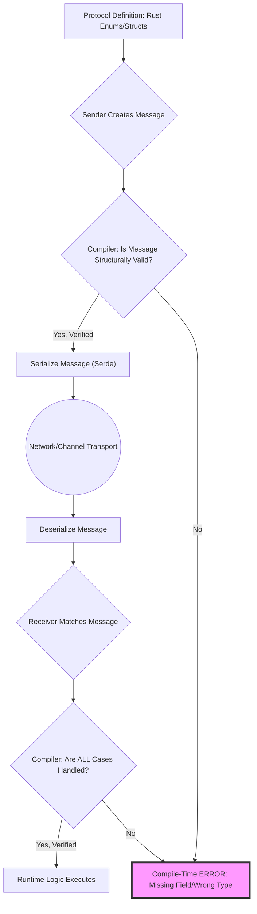
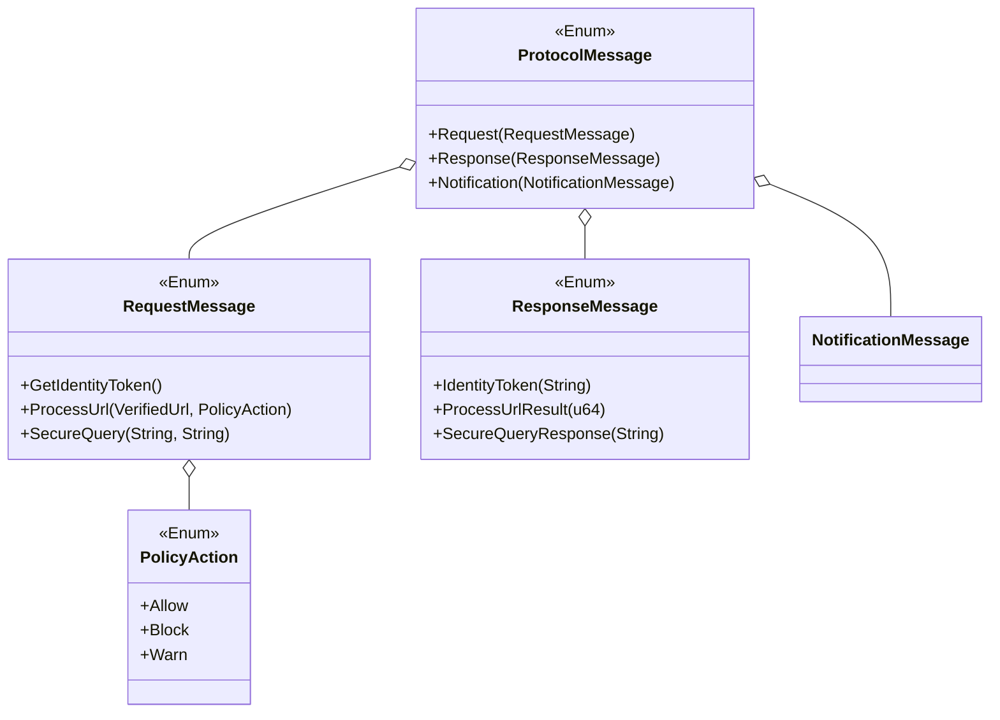
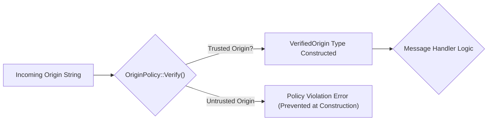

# Type-Safe Comms Crate (TSCC)

## Formally Verified Web Standards and Message Passing in Rust

This project demonstrates two use cases for formal verification via Rust's type system:

1.  **Compile-Time Protocol Verification:** Guaranteeing message passing integrity.
2.  **Web Standard Invariant Enforcement:** Creating types that can only represent valid, policy-compliant states for web concepts (like communication origins).

-----

## 1\. Protocol Verification: Structured Reasoning

We model the entire communication protocol using **Algebraic Data Types (ADTs)**, forcing the **compiler** to verify the completeness and exhaustiveness of our communication handlers.

### High-Level System Design (Flowchart)

### Type-Verification Architecture (Class Diagram)

-----

## 2\. Web Standard Verification: Origin Safety

We use a custom type (`VerifiedOrigin`) and an explicit policy (`OriginPolicy`) to ensure that any inter-window or cross-iframe communication is only processed if the origin is explicitly trusted.

### The Policy (The Formal Constraint)

The `OriginPolicy` enum formally lists all trusted origins for this service. If an origin is not in this list, a `VerifiedOrigin` cannot be constructed.

-----

## 3\. Scope & Usage (Hackathon Goal)

Our implemented Rust code addresses the following goals:

1.  Defined ADTs for a simple, two-way communication protocol.
2.  Implemented `serde` serialization/deserialization.
3.  Created a compiler-verified `handle_message` function demonstrating **exhaustiveness**.
4.  Implemented `VerifiedOrigin` and `OriginPolicy` to formally verify an incoming web standard parameter (origin) before processing a message.

## 4. Academic Context & Further Reading

The goal of leveraging the compiler's strength for security is not new; it is an active area of research that aims to replace fragile runtime checks with compile-time guarantees.

### 4.1. Formal Verification in Systems Programming

The core idea of enforcing correctness through Rust's type system is a form of **Lightweight Formal Methods**. This is a powerful trend in the development of high-assurance software, especially for operating system kernels, hypervisors, and security-critical infrastructure.

* **Verus / Prusti / Creusot:** These projects are SMT-based (Satisfiability Modulo Theories) verifiers that allow developers to write formal specifications (pre/post-conditions, invariants) directly into Rust code. TSCC's use of types to enforce a rule that **cannot be violated** aligns with the spirit of these more advanced techniques.
    * *Source:* [The Prusti Project: Formal Verification for Rust (ResearchGate)](https://www.researchgate.net/publication/360716882_The_Prusti_Project_Formal_Verification_for_Rust)
    * *Source:* [Verus: Verifying Rust Programs using Linear Ghost Types (extended version) (arXiv)](https://arxiv.org/abs/2303.05491)
* **The RustBelt Project:** This foundational work provides the formal semantic model for Rust's `unsafe` code and ownership model, ensuring the core memory safety guarantees hold even at the lowest level. The *safe* abstractions built on top of this (like TSCC) inherit these guarantees
*   * *Source:* [RustBelt: Securing the Foundations of the Rust Programming Language](https://plv.mpi-sws.org/rustbelt/popl18/)

### 4.2. Web Standard and Browser Security

The problem of ensuring a complex standard like the "Origin Policy" is correctly implemented has been a primary security concern for major browser vendors.

* **Chromium Site Isolation:** Google's work on Site Isolation, while primarily an architectural fix, demonstrates the industry's need for strict, non-bypassable policy enforcement across trust boundaries—the same high-level goal as `VerifiedOrigin`.
    * *Source:* [Site Isolation - The Chromium Projects](https://www.chromium.org/Home/chromium-security/site-isolation/)
* **Formal Shim Verification (QUARK):** Earlier research demonstrated that security guarantees (like Tab Non-Interference) can be formally established by verifying a **small, critical kernel** (or "shim") that mediates all access to resources. TSCC's message handler acts as a similar, verified shim for cross-context communication.
    * *Source:* [Establishing Browser Security Guarantees through Formal Shim Verification (USENIX)](https://www.usenix.org/system/files/conference/usenixsecurity12/sec12-final217.pdf)
