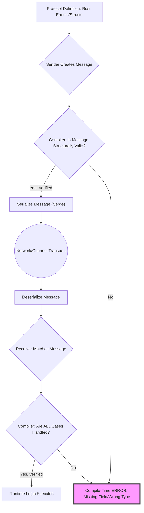
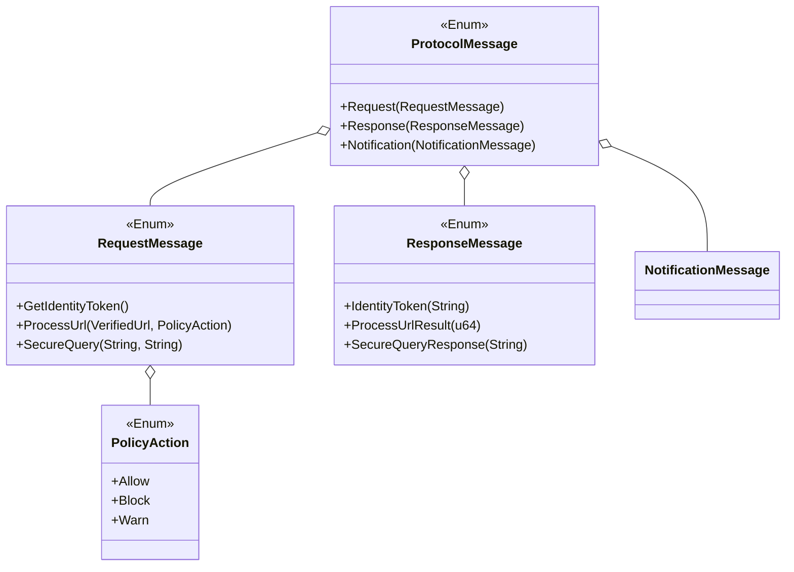
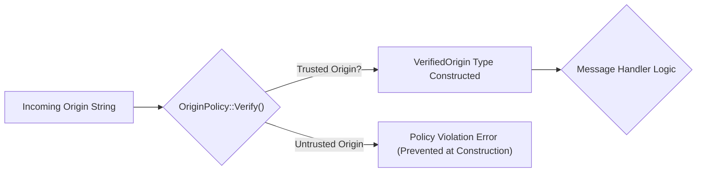

# Type-Safe Comms Crate (TSCC)

## Formally Verified Web Standards and Message Passing in Rust

This project demonstrates two critical use cases for formal verification via Rust's type system:

1.  **Compile-Time Protocol Verification:** Guaranteeing message passing integrity.
2.  **Web Standard Invariant Enforcement:** Creating types that can only represent valid, policy-compliant states for web concepts (like communication origins).

-----

## 1\. Protocol Verification: Structured Reasoning

We model the entire communication protocol using **Algebraic Data Types (ADTs)**, forcing the **compiler** to verify the completeness and exhaustiveness of our communication handlers.

### High-Level System Design (Flowchart Corrected)

### Type-Verification Architecture (Class Diagram Corrected)

-----

## 2\. Web Standard Verification: Origin Safety

We use a custom type (`VerifiedOrigin`) and an explicit policy (`OriginPolicy`) to ensure that any inter-window or cross-iframe communication is only processed if the origin is explicitly trusted.

### The Policy (The Formal Constraint)

The `OriginPolicy` enum formally lists all trusted origins for this service. If an origin is not in this list, a `VerifiedOrigin` cannot be constructed.

-----

## 3\. Scope & Usage (Hackathon Goal)

Our implemented Rust code addresses the following goals:

1.  Defined ADTs for a simple, two-way communication protocol.
2.  Implemented `serde` serialization/deserialization.
3.  Created a compiler-verified `handle_message` function demonstrating **exhaustiveness**.
4.  Implemented `VerifiedOrigin` and `OriginPolicy` to formally verify an incoming web standard parameter (origin) before processing a message.
